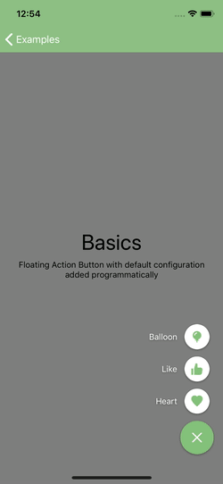

# JJFloatingActionButton
Floating Action Button for iOS


[](https://cocoapods.org/pods/JJFloatingActionButton)
[](https://cocoapods.org/pods/JJFloatingActionButton)
[](https://cocoapods.org/pods/JJFloatingActionButton)
[](https://travis-ci.org/jjochen/JJFloatingActionButton)

## Preview


## Requirements
* iOS 9.0+
* Swift 4.0+
* Xcode 9

## Installation
### CocoaPods
```ruby
use_frameworks!
pod 'JJFloatingActionButton'
```

## Usage
### Swift
```swift
let actionButton = JJFloatingActionButton()

actionButton.addItem(title: "item 1", image: UIImage(named: "first")?.withRenderingMode(.alwaysTemplate)) { item in
  // do something
}

actionButton.addItem(title: "item 2", image: UIImage(named: "second")?.withRenderingMode(.alwaysTemplate)) { item in
self.showMessage(for: item)
  // do something
}

actionButton.addItem(title: "item 3", image: nil) { item in
self.showMessage(for: item)
  // do something
}

view.addSubview(actionButton)
actionButton.translatesAutoresizingMaskIntoConstraints = false
actionButton.rightAnchor.constraint(equalTo: view.safeAreaLayoutGuide.rightAnchor, constant: -16).isActive = true
actionButton.bottomAnchor.constraint(equalTo: view.safeAreaLayoutGuide.bottomAnchor, constant: -16).isActive = true
```

## License

Photo Stickers is available under the MIT license. See the LICENSE file for more info.
